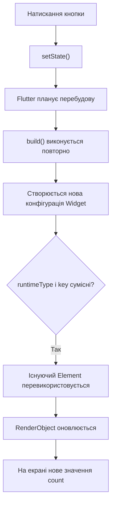
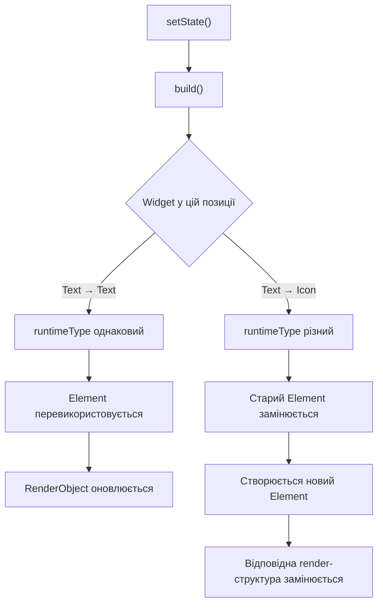

# Практична робота 2 — Технологія Flutter

## Дисципліна

Програмування для мобільних платформ

## Тема

Технологія Flutter

## Варіант 1 — Три дерева Flutter

### Мета роботи

Дослідити механізм побудови інтерфейсу у Flutter та взаємодію трьох основних дерев:

- Widget Tree;
- Element Tree;
- RenderObject Tree.

Також необхідно перевірити, як `setState()` впливає на перебудову інтерфейсу та за яких умов Flutter перевикористовує існуючий `Element`.

---

## 1. Мінімальний приклад із `setState()`

У програмі створено `StatefulWidget`, який містить лічильник `count`.

При натисканні на кнопку виконується:

```dart
setState(() => count++);
```

Виклик `setState()` повідомляє Flutter, що стан змінився і відповідний `StatefulElement` потрібно перебудувати.

У методі `build()` значення `count` використовується для формування нового інтерфейсу.

Основний фрагмент програми:

```dart
class Demo extends StatefulWidget {
  const Demo({super.key});

  @override
  State<Demo> createState() => _DemoState();
}

class _DemoState extends State<Demo> {
  int count = 0;

  @override
  Widget build(BuildContext context) {
    return Scaffold(
      body: Center(
        child: Text('Count: $count'),
      ),
      floatingActionButton: FloatingActionButton(
        onPressed: () => setState(() => count++),
        child: const Icon(Icons.add),
      ),
    );
  }
}
```

Після натискання кнопки текст змінюється:

```text
Count: 0
Count: 1
Count: 2
...
```

При цьому Flutter не створює весь застосунок заново. Перебудову проходить відповідна частина дерева.

---

## 2. Три дерева Flutter

У Flutter можна виділити три основні структури.

### Widget Tree

Widget Tree описує конфігурацію інтерфейсу. Віджети є незмінними об'єктами, які описують, яким має бути інтерфейс.

Під час виконання `build()` створюються нові конфігурації віджетів.

### Element Tree

Element Tree зберігає довгоживучі елементи, які пов'язують Widget з конкретним місцем у дереві.

Саме `Element` дозволяє Flutter зберігати стан і перевикористовувати вже існуючі елементи під час перебудови.

### RenderObject Tree

RenderObject Tree відповідає за фактичне відображення інтерфейсу: layout, малювання та hit testing.

RenderObject є більш довгоживучою структурою порівняно з Widget.

---

## 3. Що відбувається після `setState()`

Загальна послідовність роботи:



Важливо, що `setState()` не означає повне перезавантаження застосунку. Він повідомляє Flutter про зміну стану конкретного `State`.

Після цього Flutter планує перебудову відповідної частини Widget Tree.

---

## 4. Експеримент Text → Text та Text → Icon

Для перевірки поведінки дерев було змінено програму.

Залежно від значення лічильника відображається або `Text`, або `Icon`:

```dart
child: count.isEven
    ? Text(
        'Count: $count',
        style: const TextStyle(fontSize: 30),
      )
    : const Icon(
        Icons.star,
        size: 60,
      ),
```

Послідовність на екрані:

```text
Count: 0 → ⭐ → Count: 2 → ⭐
```

### Випадок Text → Text

Якщо в одній позиції дерева старий і новий Widget мають однаковий `runtimeType` та однаковий `key`, Flutter може перевикористати існуючий `Element`.

Наприклад:

```text
Text("Count: 0")
        ↓
Text("Count: 2")
```

Тип Widget залишається `Text`, тому існуючий `Element` може бути перевикористаний, а render-структура оновлюється.

### Випадок Text → Icon

Якщо Widget у цій самій позиції змінює тип:

```text
Text
 ↓
Icon
```

то `runtimeType` відрізняється.

У такому випадку старий `Element` не може бути використаний для нового Widget. Старий елемент замінюється новим, а відповідна render-структура також замінюється.

---

## 5. Які вузли перевикористовуються



У загальному випадку:

| Зміна | Widget | Element | RenderObject |
|---|---|---|---|
| `Text("0")` → `Text("2")` | нова конфігурація | перевикористовується | оновлюється |
| `Text` → `Icon` | новий тип | замінюється | відповідна render-структура замінюється |
| `setState()` | build виконується повторно | може бути перевикористаний | оновлюється за потреби |

Важливо: Widget є конфігурацією, тому створення нової Widget-конфігурації не означає автоматичного створення нового `Element` або нового `RenderObject`.

---

## 6. Правило перевикористання Element

Flutter перевіряє, чи може новий Widget оновити існуючий Element.

Основне правило визначається методом `Widget.canUpdate()`:

```dart
oldWidget.runtimeType == newWidget.runtimeType &&
oldWidget.key == newWidget.key
```

Якщо обидві умови виконуються, Flutter може оновити існуючий Element новою конфігурацією Widget.

Якщо тип Widget або `key` не відповідає, існуючий Element не перевикористовується в цій позиції.

Це дозволяє Flutter уникати непотрібного створення та знищення довгоживучих об'єктів дерева.

---

## 7. Результати експерименту

Під час виконання програми було перевірено:

1. `setState()` запускає перебудову відповідного `StatefulWidget`.
2. Метод `build()` виконується повторно після зміни стану.
3. Нова Widget-конфігурація не обов'язково означає створення нового Element.
4. При однакових `runtimeType` та `key` Element може бути перевикористаний.
5. При зміні типу Widget, наприклад `Text → Icon`, існуючий Element у цій позиції замінюється.
6. RenderObject відповідає за layout, painting та hit testing і може бути оновлений або замінений залежно від зміни дерева.

---

## 8. Перевірка проєкту

Для перевірки коректності коду виконано:

```bash
flutter analyze
```

Результат:

```text
No issues found!
```

Демонстраційний застосунок також був запущений у Chrome.

---

## 9. Висновок

Під час практичної роботи було досліджено архітектуру Flutter та взаємодію Widget Tree, Element Tree і RenderObject Tree.

Було практично перевірено роботу `setState()` та встановлено, що перебудова Widget не означає повне створення всього дерева заново.

Також було перевірено правило перевикористання `Element`: при однакових `runtimeType` та `key` Flutter може зберегти існуючий Element, а при зміні типу Widget елемент у відповідній позиції замінюється.

Таким чином, головна ідея полягає в тому, що Widget описує конфігурацію, Element забезпечує зв'язок конфігурації зі станом і позицією в дереві, а RenderObject відповідає за фактичне компонування та малювання інтерфейсу.

---

## 10. Джерела

1. Flutter Architectural Overview  
   https://docs.flutter.dev/resources/architectural-overview

2. Inside Flutter  
   https://docs.flutter.dev/resources/inside-flutter

3. Flutter performance best practices  
   https://docs.flutter.dev/perf/best-practices

4. Flutter DevTools Performance  
   https://docs.flutter.dev/tools/devtools/performance

5. `Widget.canUpdate()`  
   https://api.flutter.dev/flutter/widgets/Widget/canUpdate.html

6. `Element` class  
   https://api.flutter.dev/flutter/widgets/Element-class.html

7. `RenderObject` class  
   https://api.flutter.dev/flutter/rendering/RenderObject-class.html

8. `Widget` class  
   https://api.flutter.dev/flutter/widgets/Widget-class.html